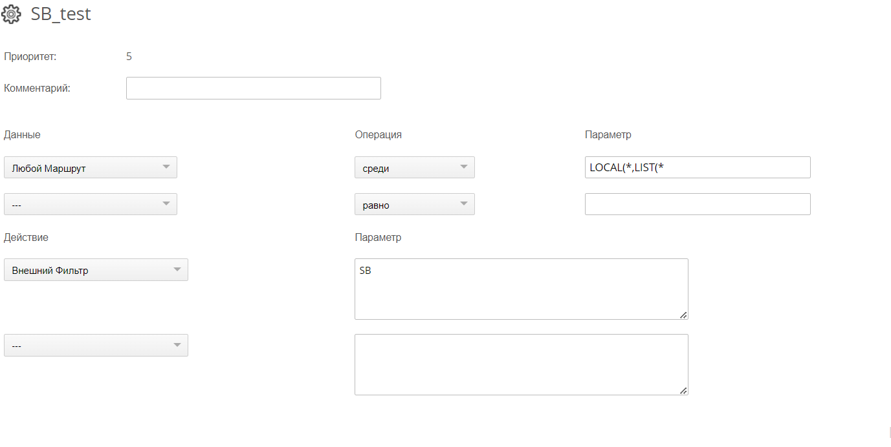
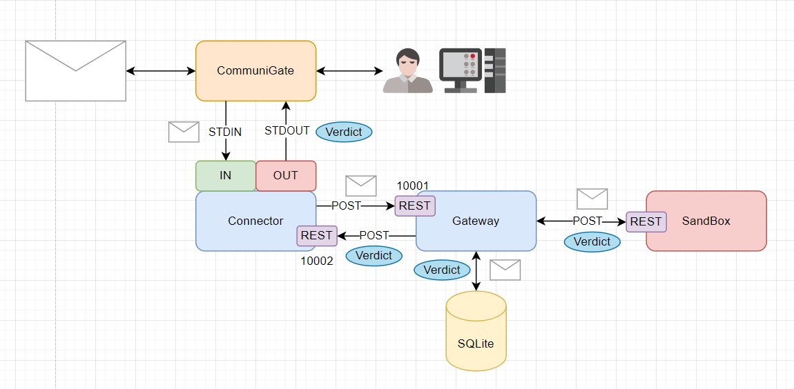

# Коннектор CommuniGate Pro к PT Sandbox
Интеграция почтового сервера CommuniGate Pro и PT Sandbox для подключения в разрыв на основе механизма помощников

# Коннектор CommuniGate Pro к PT Sandbox
Интеграция почтового сервера CommuniGate Pro и PT Sandbox для подключения в разрыв на основе механизма помощников

## Текущая логика работы служб:
### Connector
1. Использует протокол помощников ComuniGate (https://old.communigatepro.ru/CommuniGatePro/russian/Helpers.html#Protocol)
2. Работает в два потока:
- Поток 1: сервер API для обработки вердиктов и отправки в stdout
- Поток 2: цикл для чтения stdin
3. Преобразует письмо к каноничному eml (CommunniGate использует msg (не формат microsoft, просто расширение, по сути eml с кастомными заголовками) в eml, в SnadBox письмо распознается корректно.)
4. Разбирает команду и отправляет по REST на Gateway:
- Запрос один: загружается файл, в качестве ответа получает id файла в БД Gateway
- Запрос два: отправляет UID запроса (RUID) и id в БД
5. Получает от gateway ответ по REST(Поток 1) и отправляет в stdout для общения с Comunigate

### Gateway
1. Получает по REST Файл и UID запроса от коннектора
2. Кладет полученную информацию в БД (SQLite)
3. По таймауту (раз в 10 секунд) отправляет задачи на сканирование в SB, и получает ответ (отдельный поток запускается по таймеру), записывает вердикт в БД
4. По таймауту (раз в 10 секунд ) запрашивает неотправленные результаты из БД, отправляет результаты сканирования по REST в коннектор, после успешной отправки удаляет сведения из БД 

### Требования к настройкам на стороне CommuniGate
1. Настроен помощник фильтрации данных Установки -> Общее -> Помощники → Фильтрация данных 
2. Строка для запуска /usr/local/bin/python -u /var/CommuniGate/PTConnector/connector/connector.py (ключ -u для отключения буферизации как требования протокола)
3. Настроено правило обработки почты: 

### Схема взаимодействия компонентов

### Использованные технологии
- В качестве сервера API используется uvicorn
- В качестве API используется FastAPI
- В качестве БД используется SQLite3
- Переменные для настроек вынесены в .env файлы
- Для сервиса Gateway в текущей реализации используется Docker

Требования к окружению:
- Python >= 3.8
- fastapi>=0.112.2
- pydantic>=2.8.2
- python-dotenv>=1.0.1
- Requests>=2.32.3
- uvicorn>=0.30.6
